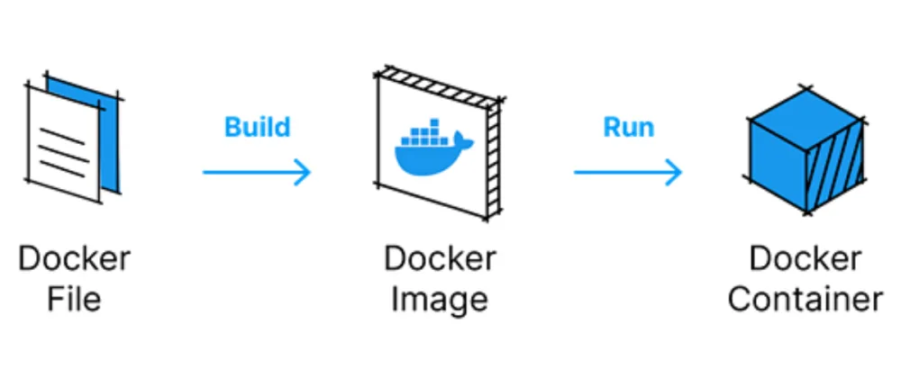

# Week 1 - Setup and First Steps

<br/><br/>
## Docker + Postgres
----------------------------

### Docker

Docker provides consistent and easily reproducible environments, isolating your pipeline.



- Docker image: a blueprint of a container.
	- Docker file: a text document with all commands to create a Docker image.
- Docker container: is the isolated environment created.


###### Running a script with python and pandas in a container.

First, we create a simple python script:
```python
import sys
import pandas as pd

print(sys.argv)
date = sys.argv[1]

print(f'job finished successfully for {date}')
```

Next, we create a Docker file which runs the .py file we've just made:
```dockerfile
# Docker image with python 
FROM python:3.9

# create an image with pandas installed 
RUN pip install pandas

# change target dir inside the container
WORKDIR /app

# COPY source file (local) to destination (container)
COPY pipeline.py pipeline.py

# executables that will run when container is initiated
ENTRYPOINT ["python", "pipeline.py"]
```

Now we create the container:
```bash
docker build -t test:pandas . # the dot will search the directory for a docker file
```

And then, we run it:
```bash
docker run -it test:pandas 2023-01-15 # date passed as an argument
```

<br/><br/>

### Postgres

Creating a container with postgres.

```bash
docker run -it \
    -e POSTGRES_USER="root" \
    -e POSTGRES_PASSWORD="root" \
    -e POSTGRES_DB="ny_taxi" \
    -v "//c/Users/sauld/OneDrive/Documents/Repos/de-zoomcamp-notes/week-1/content/ny_taxi_postgres_data:/var/lib/postgresql/data" \
    -p 5432:5432 \
postgres:13
```

Then in a new window (or tab):
```bash
pgcli -h localhost -p 5432 -u root -d ny_taxi
```


We can now ingest data into this container. We're going to use a [dataset](https://www.nyc.gov/site/tlc/about/tlc-trip-record-data.page) containing detailed information on taxi trips in NY.
The guys from DataTalks have uploaded backup files in [csv](https://github.com/DataTalksClub/nyc-tlc-data) format.

Running the [upload_data](https://github.com/saulzera/data-engineering-zoomcamp/blob/master/week-1/content/upload_data.ipynb)notebook we can ingest our taxi data into postgres.


Now, we can setup PgAdmin container, which will allow us to interact better with the database.
But first we create a docker network, in order to make postgres and pgadmin "locate" each other. It will link both docker containers.

```bash
docker network create pg-network
```

After creating the container with pgadmin, we add the network info to both postgres and pgadmin (in postgress we name it pg-database):
```bash
docker run -it\
    -e PGADMIN_DEFAULT_EMAIL="admin@admin.com"\
    -e PGADMIN_DEFAULT_PASSWORD="root"\
    -p 8080:80 \
    --network=pg-network\
    --name pgadmin \
dpage/pgadmin4
```


Then we can access it in the localhost using our browser:

![[pgadmin.png]]

We can now manage our database through pgAdmin.


## Converting the Ingestion Notebook into a Python Script


