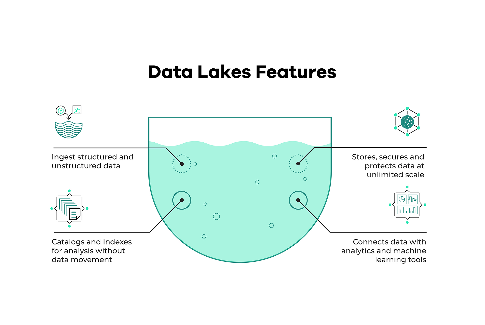
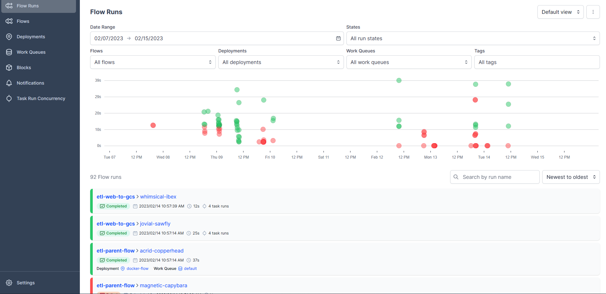

###### Top

# Data Lake

A repository that stores all kinds of raw data, making it available to a wide range of use cases.



With poor organization it might become a data swamp, turning it inaccessible to the users and providing little value.


# Workflow Orchestration

Governing a dataflow in a way that respects the **orchestration rules** and **business logic**, turning code into a workflow that we can schedule, run and observe.

##### Core Features
- Remote Execution
- Scheduling
- Retries
- Caching
- Integration with external systeams (API, database)
- Ad-hoc runs
- Parametrization
- Alerts

# Prefect

## Intro to Prefect Concepts


First we create an environment (I named it zoomcamp) and install all libraries from [requirements.txt]() through terminal:
```bash
conda install -r requirements.txt
```

#### Prefect Flow
Flows are like functions and any function can become a flow by using the **@flow** decorator, giving the following advantages:
- State transitions are reported to the API, allowing observation of flow execution.
- Input arguments types can be validated.
- Retries can be performed on failure.
- Timeouts can be enforced to prevent unintentional, long-running workflows.

We can transform the [ingest_data.py](https://github.com/saulzera/data-engineering-zoomcamp/blob/master/week-1/content/ingest_data.py) script into a Prefect Flow adding the **@flow** decorator before calling the main function.

#### Prefect Task
In a Prefect workflow, tasks are functions that receive metadata about upstream dependencies before they run, which could be used to have a task wait on the completion of another task before executing.

We can create a task to transform the data before ingesting it, for example, removing the trips with 0 passengers, by placing the **@taks** decorator before the transfoming function.

```python
@task(log_prints=True)
def transform_data(df):
    print(f"pre: missing passenger count: {df['passenger_count'].isin([0]).sum()}")
    df = df[df['passenger_count'] != 0]
    print(f"post: missing passenger count: {df['passenger_count'].isin([0]).sum()}")
    return df
```


#### Orion: Prefect local UI

Setting up prefect in terminal:
```bash
prefect config set PREFECT_API_URL="http://127.0.0.1:4200/api" # config profile

prefect orion start # start the UI locally
```

We can access the UI at localhost:4200, and there we can monitor our flow runs. 



#### Blocks

Blocks provide the storage of configuration and provide interaction with external systems.
Set up a SQLAlchemy block in prefect using these parameters:
>Connection Info
>{ "driver": "postgresql+psycopg2", "database": "ny_taxi", "username": "root", "password": "root", "host": "localhost", "port": "5432" }

Then we can call it in our flow script:
```python
@task(log_prints=True, retries=3)
def ingest_data(table, df):

    connection_block = SqlAlchemyConnector.load("pg-connector")

    with connection_block.get_connection(begin=False) as engine:
        df.head(n=0).to_sql(name=table, con=engine, if_exists='append')
        df.to_sql(name=table, con=engine, if_exists='append')
```
----
__[Back to Top](#top)__
<br/><br/>

# ETL with GPC & Prefect


#### Prefect Blocks: GCP Bucket

```bash
prefect block register -m prefect_gcp
```

Terminal output:


> 


## Parametrizing Flow & Deployments with ETL into GCS flow


Using our _etl_web_to_gcs.py_ file as a base, we can parameterize a flow run.


```bash
prefect deployment build . ../parameterized_flow.py:etl_parent_flow -n "Parameterized ETL"
```

Expected result:
```bash
Found flow 'etl-parent-flow'
Default '.prefectignore' file written to C:\Users\sauld\OneDrive\Documents\Repos\de-zoomcamp-notes\week-2\flows\gcp\.prefectignore
Deployment YAML created at 'C:\Users\sauld\OneDrive\Documents\Repos\de-zoomcamp-notes\week-2\flows\gcp\etl_parent_flow-deployment.yaml'.
Deployment storage None does not have upload capabilities; no files uploaded.  Pass --skip-upload to suppress this warning.
```

This creates an YAML file with the metadata from the flow, and we can set its parameters from there, such as 'color', 'months' and 'year'.


Now we can apply them using command line:
```bash
prefect deployment apply etl_parent_flow-deployment.yaml
```


## Schedules & Docker Storage with Infrastructure

> Storage


```dockerfile
FROM prefecthq/prefect:2.7.7-python3.9  

COPY docker-requirements.txt .

RUN pip install -r docker-requirements.txt --trusted-host pypi.python.org --no-cache-dir

COPY flows /opt/prefect/flows
COPY flows/gcp/data /opt/prefect/data
```

Then create and run the image:
```bash
docker image build -t username/prefect:zoom .

docker image push username/prefect:zoom
```

Then create a docker-container block in prefect, and import it to a python file and run it:
```bash
python flows/docker_deploy.py
```

If its not set yet, configure prefect api:
```bash
prefect profile ls # to see current profile

prefect config set PREFECT_API_URL="http://127.0.0.1:4200/api"

prefect agent start -q default # will start the current agent
```

Then we can finally run our flow to run the script in a docker container in prefect:
```bash
# -p to pass the parameters, otherwise it will deploy the default parameters
prefect deployment run etl-parent-flow/docker-flow -p "months=[1, 2, 3, 4]"
```

__[Back to Top](#top)__