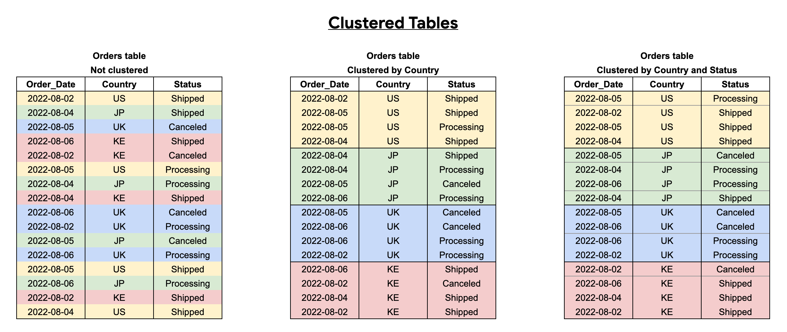
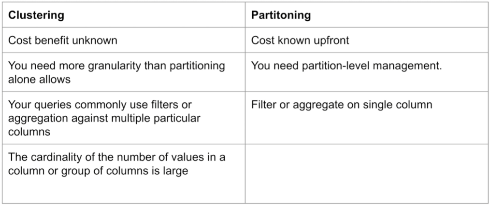

###### Top

# Data Warehouse & BigQuery
 

## OLTP vs OLAP

**Online Analytical Processing (OLAP)** is a system for performing analysis at high speeds on large volumes of data, usually from a data warehouse, or other centralized data store.
Ideal for data mining, BI, and complex analytical calculations.

**Online Transactional Processing (OLTP)** is a system that enables real-time execution of large numbers of database transactions by large number of people. 
Optmized for processing a massive number of transactions.

## Data Warehouse

OLAP solution used for reporting and data analysis.
A data warehouse is a data management system which aggregates large volumes of data from multiple sources into a single repository of highly structured and unified historical data.

## BigQuery
- Serveless data warehouse. No servers to manage or database software to install.
- Scalable and highly available
- Separates the compute engine that analyzes data from the storage.

#### BigQuery Partition
Divides a table in order to improve performance and cost (less bytes read by a query).

#### BigQuery Clustering
A table with user-defined column sort.

Clustering accelerates queries because the query only scans the blocks that match the filter.

> Table with data size < 1GB won't show significant improvement with partitioning and clustering

#### BigQuery Best Practices

Refer to [documentation](https://cloud.google.com/bigquery/docs/best-practices-performance-communication) for better guidance.

###### Cost reduction
- Avoid SELECT *
- Price queries before running
- Clustered or partitioned tables
- Caution on streaming inserts
- Materialize query results in stages

###### Query performance
- Filter on partitioned columns
- Denormalize data
- Use nested or repeated columns
- Reduce data before using a join
- Place table with largest number of rows first followed by the table with fewest rows, then place remaining tables by decreasing size

