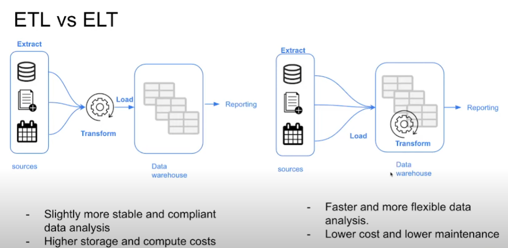
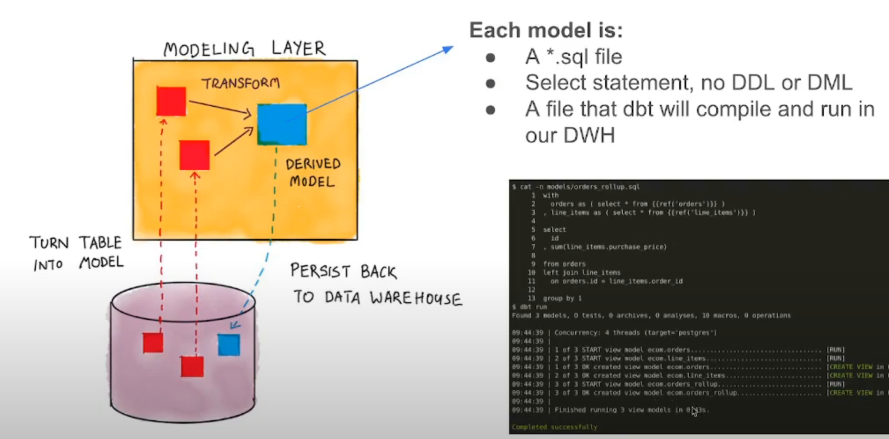

###### Top

# Analytics Engineering

A middle ground between data engineering and data analysis.
Introduces the good software engineering practices to the efforts of data analysis and data science.

 

# Data Modeling

## ETL vs ELT

---
## Kimball's Dimensional Modeling

###### Objective
Deliver data understandable to the business users and deliver fast query performance.

###### Approach
Prioritise user understandability and query performance over non redundant data ([3NF](https://en.wikipedia.org/wiki/Third_normal_form)).
Other approaches:
- Bill Inmon
- Data vault

 

#### Elements of Dimensional Modeling
refer to [Star schema](https://en.wikipedia.org/wiki/Star_schema).

 

###### Fact tables
- Measurements, metrics, facts.
- Corresponds to a business process.
- "Verbs".

###### Dimension tables
- Corresponds to a business entity.
- Provides context to a business process.
- "Nouns".

 

#### Architecture of Dimensional Modeling
###### Stage Area
- Contains the raw data.
- Not meant to be exposed to everyone.

###### Processing Area
- From raw data to data models.
- Focuses in efficiency.
- Ensuring standards.

###### Presentation Area
- Final presentation of the data.
- Exposure to business stakeholder.

---
[Back to Top](#Top)
 

# What is dbt?

Data build tool (dbt) is a transformation tool which enables anyone that knows SQL to deploy analytics code following software engineering best practices, like modularity, portability, CI/CD and documentation.

## How does dbt work?

 

## How to use dbt?

###### dbt Core
Open-source project that allows the data transformation.
- Builds and runs a dbt project (.sql and .yml files).
- Includes SQL compilation logic, macros and database adapters.
- Includes a CLI to run dbt commands locally.

###### dbt Cloud
SaaS application to develop and manage dbt projects.
- Web-based IDE to develop, run and test a dbt project.
- Jobs orchestration.
- Logging and Alerting.
- Integrated documentation.
- Free for individuals (one dev seat).

