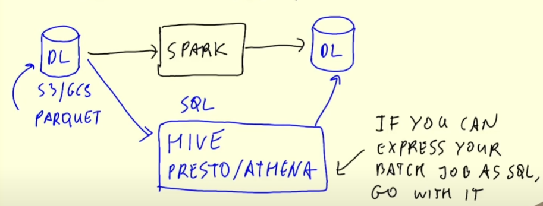

# Batch Processing

A method to periodically complete high-volume, repetitive data jobs, usually daily or hourly.

### Technologies
- Python scripts (run anywhere e.g. kubernets, aws batch)
- SQL
- Spark
- Flink

### Advantages 
- Easy to manage
- Retry
- Scalability

### Disadvantages
- Delay (might need to wait the process before using the data)


## Apache Spark

Data processing multi-language engine. 

### When to use?


Mostly when you can't express your batch job as SQL.

### Setup Spark

#### Java
Spark needs Java, so download the JDK and add it to PATH using MINGW/Gitbash:
```bash
export JAVA_HOME="/c/tools/jdk-11.0.17" # path where you unpacked the JDK 
export PATH="${JAVA_HOME}/bin:${PATH}"

java --version # to see if it works
```


#### Hadoop
Next we need hadoop binaries. We're pulling the files from this [link](https://github.com/cdarlint/winutils/tree/master/hadoop-3.2.0/bin)
Create a folder (`/c/tools/hadoop-3.2.0`) and put the files there. 
```bash
HADOOP_VERSION="3.2.0"
PREFIX="https://raw.githubusercontent.com/cdarlint/winutils/master/hadoop-${HADOOP_VERSION}/bin/"

FILES="hadoop.dll hadoop.exp hadoop.lib hadoop.pdb libwinutils.lib winutils.exe winutils.pdb"

for FILE in ${FILES}; do
  wget "${PREFIX}/${FILE}"
done
```
Add it to PATH:
```bash
export HADOOP_HOME="/c/tools/hadoop-3.2.0"
export PATH="${HADOOP_HOME}/bin:${PATH}"
```

#### Spark
Now download Spark and select version 3.0.3 (3.2.0 has problems starting the shell on Windows).
```bash
 wget https://archive.apache.org/dist/spark/spark-3.0.3/spark-3.0.3-bin-hadoop3.2.tgz
 
 # then unpack
 tar xzfv spark-3.0.3-bin-hadoop3.2.tgz
```

Add it to PATH:
```bash
export SPARK_HOME="/c/tools/spark-3.0.3-bin-hadoop3.2"
export PATH="${SPARK_HOME}/bin:${PATH}"
```

Go to spark folder in order to test it, and then run:
```bash
./bin/spark-shell.cmd
```

#### PySpark
```bash
export PYTHONPATH="${SPARK_HOME}/python/:$PYTHONPATH"
export PYTHONPATH="${SPARK_HOME}/python/lib/py4j-0.10.9-src.zip:$PYTHONPATH"
```
